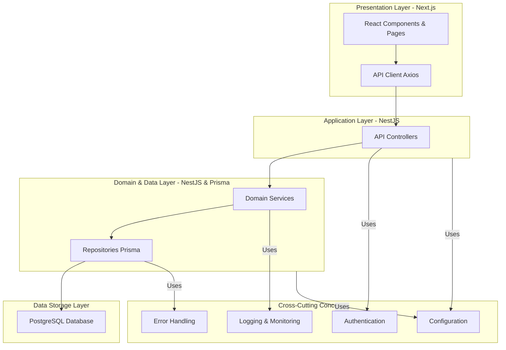
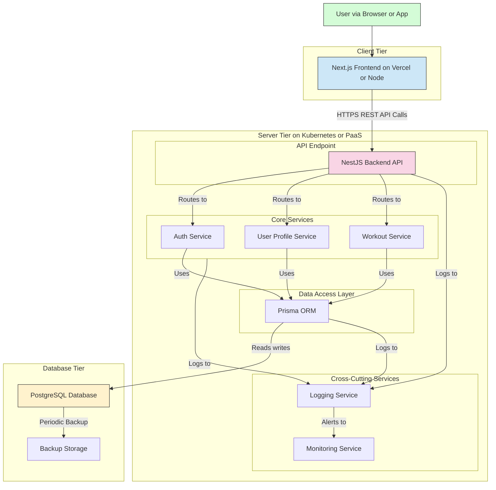

### Sorting and Dependency Building Algorithm Execution

*   **Step 1. Identify Infrastructure and Cross-cutting Concerns**: The following foundational items are identified as prerequisites for all business logic and assigned to **T0-INFRA**:
    *   Project setup, CI/CD pipeline, and configuration management.
    *   Database connection, schema migration framework.
    *   Unified logging, monitoring, and observability framework.
    *   Centralized error handling and standardized API response format.
    *   Authentication and authorization foundation (JWT generation/validation middleware).
    *   Mandatory NFRs: Transport encryption (HTTPS), storage security (password hashing), and backup/recovery procedures.

*   **Step 2. Product Dependency Graph (Product DAG)**: The product backlog is analyzed for dependencies and priorities.
    *   **P-Order**: A topological sort based on priority (P0 -> P1 -> P2) and logical user flow yields the following order:
        1.  [EPIC-001-S1] User Registration
        2.  [EPIC-001-S2] User Login
        3.  [EPIC-002-S1] Initiate New Workout Session
        4.  [EPIC-002-S2] Select Exercise from Library
        5.  [EPIC-002-S4] Record Strength Training Parameters
        6.  [EPIC-002-S5] Record Cardio/Time-Based Parameters
        7.  [EPIC-002-S7] Complete and Save Workout Session
        8.  [EPIC-001-S3] Basic Profile Management
        9.  [EPIC-002-S3] Add Custom Exercise During Workout
        10. [EPIC-002-S8] Edit Past Workout Session
        11. [EPIC-002-S6] Record Optional Rest Time
        12. [EPIC-002-S9] Delete Past Workout Session
    *   **UX/UI Constraint Extraction**:
        *   **Validation Rules**: Email format, non-empty passwords/names, numeric inputs for reps/weight/distance are extracted from `UX-001`, `UX-003`, `UX-006`, `UX-007`, `UX-008`. These map to API validation schemas and DB constraints.
        *   **Interaction States**: `loading`, `disabled`, `error`, `empty` states for buttons and inputs (from `UI.InteractionSpecs`) require the API to handle idempotent requests and provide distinct success/error responses.
        *   **Data Requirements**: Exercise library search (`UX-005`) implies a searchable index on the exercises table. Workout history lists (`UX-011`, `UX-012`) imply pagination and filtering capabilities on workout session queries.

*   **Step 3. Capability Mapping and Technology Vertical Slicing**:
    *   Each story is mapped to the required technical capabilities (API, Domain, Data).
    *   The "minimal closed loop" is identified as the core user journey of registering, logging in, and successfully logging a complete workout. This corresponds to P-Order items 1 through 7.
    *   All technical items required to implement this minimal loop are labeled **T0-CORE**.

*   **Step 4. Build the Final Technology DAG**:
    *   Dependencies are established:
        *   All `T0-CORE`, `T1`, `T2` items depend on `T0-INFRA` items.
        *   `Workout Session Management` capabilities depend on `User & Account Management` capabilities (e.g., creating a workout requires an authenticated user).
        *   `Edit/Delete Workout` (`T2`/`T3`) depends on `Save Workout` (`T0-CORE`).

*   **Step 5. Assign Technology Priorities (T-Stage)**:
    *   **T0-INFRA**: Foundational, cross-cutting concerns.
    *   **T0-CORE**: The minimal closed-loop user journey (Register, Login, Create/Log/Save Workout).
    *   **T1**: P1-priority features that build upon the core loop (Profile Mgt, Custom Exercise, Edit Workout).
    *   **T2**: P2-priority features (Rest Timer, Delete Workout).
    *   **T3**: P3-priority features (None in this backlog).

The final sorted plan is reflected in the System Backlog below.

---
### 1. Technology Stack Description

*   **Frontend**: **Next.js (React)**. A robust framework providing Server-Side Rendering (SSR) for fast initial loads, static site generation for marketing pages, and a rich ecosystem. TypeScript will be used for type safety.
*   **Backend**: **NestJS (Node.js/TypeScript)**. A progressive, opinionated framework that enforces a structured, modular architecture (Controllers, Services, Repositories), which is excellent for scalability and maintainability. It integrates well with TypeScript and standard tooling.
*   **Database**: **PostgreSQL**. A powerful, open-source relational database known for its reliability, feature robustness, and extensibility. It's well-suited for structured data like users, workouts, and exercises.
*   **ORM**: **Prisma**. A next-generation ORM for Node.js and TypeScript that provides excellent type safety, an intuitive query API, and a robust migration system, simplifying database interactions.
*   **Deployment**: **Docker & Kubernetes (or a PaaS like Vercel/Heroku)**. The applications will be containerized using Docker for consistency across environments. Kubernetes or a Platform-as-a-Service will be used for orchestration, scaling, and managing deployments.

### 2. System Layer Description



*   **Presentation Layer**: Responsible for rendering the UI and handling user interactions. It communicates with the backend via a dedicated API client.
*   **Application Layer**: Exposes the system's capabilities via a RESTful API. It handles incoming requests, validates data, and orchestrates calls to the domain layer.
*   **Domain & Data Layer**: Contains the core business logic (Domain Services) and abstracts data persistence (Repositories). This layer is responsible for enforcing business rules and interacting with the database.
*   **Data Storage Layer**: The PostgreSQL database, responsible for the persistent storage of all application data.
*   **Cross-Cutting Concerns**: Modules like Authentication, Logging, and Error Handling that are used across multiple layers to provide essential non-functional capabilities.

### 3. System Architecture Diagram



### 4. Capability Mapping Table (Story → Capability → Module)

| StoryId | Product Priority | API Requirements | Domain Services | Data Entities/Index | Authentication Points | External Integrations | Description/UX/UI Constraints |
| --- | --- | --- | --- | --- | --- | --- | --- |
| EPIC-001-S1 | P0 | `POST /auth/register` | `AuthService.register(dto)` | `User` (email `UNIQUE` index) | Public | N/A | Valid email format, non-empty password. Source: `UX-001`. |
| EPIC-001-S2 | P0 | `POST /auth/login` | `AuthService.login(dto)` | `User` (read) | Public | N/A | Returns JWT on success. Source: `UX-002`. |
| EPIC-001-S3 | P1 | `GET /profile`, `PUT /profile` | `ProfileService.getProfile()`, `ProfileService.updateProfile()` | `User` (read/update) | JWT Required | N/A | Display name cannot be empty. Unit preference is an enum. Source: `UX-003`. |
| EPIC-002-S1 | P0 | `POST /workouts` | `WorkoutService.startSession(userId, dto)` | `WorkoutSession` (create) | JWT Required | N/A | Can start for "now" or a past date. Source: `UX-004`. |
| EPIC-002-S2 | P0 | `GET /exercises` | `ExerciseService.searchLibrary(query)` | `Exercise` (search by name, index on `name` column) | JWT Required | N/A | Real-time filtering implies efficient search. Source: `UX-005`. |
| EPIC-002-S3 | P1 | `POST /exercises` | `ExerciseService.createCustom(userId, dto)` | `Exercise` (create with `created_by_user_id`) | JWT Required | N/A | Exercise name cannot be empty. Source: `UX-006`. |
| EPIC-002-S4 | P0 | `POST /workouts/{id}/logged-exercises/{leId}/sets` | `WorkoutService.logStrengthSet(dto)` | `LoggedExercise`, `StrengthSet` (create) | JWT Required | N/A | Reps and weight must be non-negative numbers. Source: `UX-007`. |
| EPIC-002-S5 | P0 | `POST /workouts/{id}/logged-exercises/{leId}/cardio` | `WorkoutService.logCardioEntry(dto)` | `LoggedExercise`, `CardioEntry` (create) | JWT Required | N/A | Duration and distance must be non-negative numbers. Source: `UX-008`. |
| EPIC-002-S6 | P2 | (No new API, part of client-side logic) | N/A | N/A | JWT Required | N/A | Timer logic is handled on the client. Source: `UX-009`. |
| EPIC-002-S7 | P0 | `PUT /workouts/{id}/complete` | `WorkoutService.completeSession(sessionId)` | `WorkoutSession` (update `end_time`, status) | JWT Required | N/A | Handles network errors and provides retry logic. Source: `UX-010`. |
| EPIC-002-S8 | P1 | `PUT /workouts/{id}` | `WorkoutService.editSession(sessionId, dto)` | `WorkoutSession`, `LoggedExercise`, `StrengthSet`, `CardioEntry` (CRUD) | JWT Required | N/A | All parameters must be re-validated. Source: `UX-011`. |
| EPIC-002-S9 | P2 | `DELETE /workouts/{id}` | `WorkoutService.deleteSession(sessionId)` | `WorkoutSession` and related entries (cascade delete) | JWT Required | N/A | Protected by a confirmation dialog on UI. Source: `UX-012`. |
| NFR | System | N/A | `LoggerService` | Logs | N/A | N/A | Structured logs for observability. Source: System Required. |
| NFR | System | N/A | `AuthService` (Hashing) | `User` (password_hash) | N/A | N/A | Passwords must be hashed with bcrypt. Source: System Required. |
| NFR | System | N/A | N/A | N/A | N/A | N/A | All traffic must be over HTTPS. Source: System Required. |
| NFR | System | N/A | N/A | DB Backups | N/A | N/A | Regular database backups. Source: System Required. |

### 5. System Backlog (Technical Perspective, including sorting results)

| # | SYS-ID | Name | Type | T-Stage | Dependency | Traceability | Brief Description |
|---|---|---|---|---|---|---|---|
| 1 | SYS-INFRA-SETUP-01 | Monorepo & CI/CD Pipeline Setup | INFRA | T0-INFRA | - | System Required | Initialize pnpm workspace, configure basic CI/CD for linting, testing, and building. |
| 2 | SYS-INFRA-CONFIG-01 | Configuration Management | INFRA | T0-INFRA | - | System Required | Setup environment variable handling (e.g., `.env`) for database URLs, secrets. |
| 3 | SYS-INFRA-DB-01 | Database & Migration Setup | INFRA | T0-INFRA | SYS-INFRA-CONFIG-01 | System Required | Configure Prisma, generate initial schema, and establish migration workflow. |
| 4 | SYS-INFRA-LOG-01 | Logging and Observability Framework | INFRA | T0-INFRA | - | System Required | Integrate a structured logger (e.g., Pino) into the NestJS backend. |
| 5 | SYS-INFRA-ERROR-01 | Unified Error Handling | INFRA | T0-INFRA | SYS-INFRA-LOG-01 | System Required | Create a global exception filter in NestJS to standardize error responses. |
| 6 | SYS-INFRA-SEC-01 | Transport Encryption (HTTPS) | INFRA | T0-INFRA | - | System Required | Configure deployment environment to enforce HTTPS on all endpoints. |
| 7 | SYS-INFRA-SEC-02 | Password Hashing Implementation | INFRA | T0-INFRA | - | System Required | Integrate bcrypt for hashing and comparing passwords. |
| 8 | SYS-INFRA-AUTH-01 | JWT Authentication Foundation | INFRA | T0-INFRA | SYS-INFRA-SEC-02 | System Required | Setup NestJS Passport with JWT strategy for token generation and validation. |
| 9 | SYS-INFRA-BACKUP-01 | Database Backup Strategy | INFRA | T0-INFRA | SYS-INFRA-DB-01 | System Required | Configure automated daily backups of the PostgreSQL database. |
| 10 | SYS-CORE-AUTH-01 | User Registration Endpoint | CORE | T0-CORE | SYS-INFRA-AUTH-01, SYS-INFRA-DB-01 | EPIC-001-S1 | Implement API and service for creating a new user account. |
| 11 | SYS-CORE-AUTH-02 | User Login Endpoint | CORE | T0-CORE | SYS-INFRA-AUTH-01 | EPIC-001-S2 | Implement API and service for authenticating users and issuing JWTs. |
| 12 | SYS-CORE-WORKOUT-01 | Initiate Workout Session | CORE | T0-CORE | SYS-CORE-AUTH-02 | EPIC-002-S1 | API to create a new `WorkoutSession` record linked to the authenticated user. |
| 13 | SYS-CORE-EXERCISE-01 | Exercise Library Search | CORE | T0-CORE | SYS-CORE-AUTH-02 | EPIC-002-S2 | API to list and search predefined exercises. |
| 14 | SYS-CORE-WORKOUT-02 | Record Strength Training Data | CORE | T0-CORE | SYS-CORE-WORKOUT-01 | EPIC-002-S4 | API to add strength sets (reps, weight) to a logged exercise in a session. |
| 15 | SYS-CORE-WORKOUT-03 | Record Cardio Training Data | CORE | T0-CORE | SYS-CORE-WORKOUT-01 | EPIC-002-S5 | API to add cardio entries (duration, distance) to a logged exercise. |
| 16 | SYS-CORE-WORKOUT-04 | Complete and Save Workout | CORE | T0-CORE | SYS-CORE-WORKOUT-01 | EPIC-002-S7 | API to finalize a workout session, setting its end time. |
| 17 | SYS-PLAT-PROFILE-01 | Profile Management | PLAT | T1 | SYS-CORE-AUTH-02 | EPIC-001-S3 | APIs to get and update user profile information (display name, units). |
| 18 | SYS-PLAT-EXERCISE-02 | Create Custom Exercise | PLAT | T1 | SYS-CORE-AUTH-02 | EPIC-002-S3 | API for a user to create a new custom exercise in their library. |
| 19 | SYS-PLAT-WORKOUT-05 | Edit Past Workout | PLAT | T1 | SYS-CORE-WORKOUT-04 | EPIC-002-S8 | API to modify the details of a previously saved workout session. |
| 20 | SYS-EXT-WORKOUT-06 | Record Optional Rest Time | EXT | T2 | - | EPIC-002-S6 | Implement client-side timer logic; no backend changes required. |
| 21 | SYS-EXT-WORKOUT-07 | Delete Past Workout | EXT | T2 | SYS-CORE-WORKOUT-04 | EPIC-002-S9 | API to permanently delete a workout session and all its associated data. |

### 6. Database Design

```prisma
// This schema corresponds to the SYS-INFRA-DB-01 task.
// It defines the data models for the entire application.

generator client {
  provider = "prisma-client-js"
}

datasource db {
  provider = "postgresql"
  url      = env("DATABASE_URL")
}

// -- SYS-CORE-AUTH-01: User Management
model User {
  id               String    @id @default(cuid())
  email            String    @unique
  passwordHash     String
  displayName      String?
  preferredUnits   Units     @default(METRIC)
  createdAt        DateTime  @default(now())
  updatedAt        DateTime  @updatedAt
  workoutSessions  WorkoutSession[]
  customExercises  Exercise[]
}

enum Units {
  METRIC   // kg, km
  IMPERIAL // lbs, mi
}

// -- SYS-CORE-EXERCISE-01 & SYS-PLAT-EXERCISE-02: Exercise Library
model Exercise {
  id                String            @id @default(cuid())
  name              String
  type              ExerciseType
  // Null if it's a predefined system exercise
  createdBy         User?             @relation(fields: [createdById], references: [id])
  createdById       String?
  createdAt         DateTime          @default(now())
  updatedAt         DateTime          @updatedAt
  loggedExercises   LoggedExercise[]

  @@unique([name, createdById]) // A user cannot have two custom exercises with the same name
}

enum ExerciseType {
  STRENGTH
  CARDIO
}

// -- SYS-CORE-WORKOUT-01: Workout Session Management
model WorkoutSession {
  id              String            @id @default(cuid())
  user            User              @relation(fields: [userId], references: [id], onDelete: Cascade)
  userId          String
  startTime       DateTime
  endTime         DateTime?
  createdAt       DateTime          @default(now())
  updatedAt       DateTime          @updatedAt
  loggedExercises LoggedExercise[]

  @@index([userId, startTime])
}

// Intermediate model to link an Exercise to a WorkoutSession
model LoggedExercise {
  id              String            @id @default(cuid())
  session         WorkoutSession    @relation(fields: [sessionId], references: [id], onDelete: Cascade)
  sessionId       String
  exercise        Exercise          @relation(fields: [exerciseId], references: [id], onDelete: Restrict) // Prevent deleting an exercise if it's in a log
  exerciseId      String
  notes           String?
  strengthSets    StrengthSet[]
  cardioEntry     CardioEntry?

  @@index([sessionId])
}

// -- SYS-CORE-WORKOUT-02: Strength Training Data
model StrengthSet {
  id                String         @id @default(cuid())
  loggedExercise    LoggedExercise @relation(fields: [loggedExerciseId], references: [id], onDelete: Cascade)
  loggedExerciseId  String
  setNumber         Int
  reps              Int
  weight            Float // Stored in a base unit (e.g., kg), converted on the client
  createdAt         DateTime       @default(now())

  @@index([loggedExerciseId])
}

// -- SYS-CORE-WORKOUT-03: Cardio Training Data
model CardioEntry {
  id                String         @id @default(cuid())
  loggedExercise    LoggedExercise @relation(fields: [loggedExerciseId], references: [id], onDelete: Cascade)
  loggedExerciseId  String         @unique
  durationSeconds   Int?
  distanceMeters    Float?
  createdAt         DateTime       @default(now())
}

```
**Migration & Rollback Note**: Prisma handles migrations automatically. `npx prisma migrate dev --name init` would create the initial SQL migration file. Rollbacks are managed by reverting migrations, a process also handled by the Prisma CLI.

**Seed Data Example (`seed.ts`):**
```typescript
// Part of SYS-CORE-EXERCISE-01
import { PrismaClient, ExerciseType } from '@prisma/client';
const prisma = new PrismaClient();

async function main() {
  await prisma.exercise.createMany({
    data: [
      { name: 'Bench Press', type: ExerciseType.STRENGTH },
      { name: 'Squat', type: ExerciseType.STRENGTH },
      { name: 'Deadlift', type: ExerciseType.STRENGTH },
      { name: 'Running', type: ExerciseType.CARDIO },
      { name: 'Cycling', type: ExerciseType.CARDIO },
    ],
    skipDuplicates: true,
  });
}

main().catch(e => console.error(e)).finally(async () => await prisma.$disconnect());
```

### 7. API Design

```yaml
openapi: 3.0.0
info:
  title: MyFitness2 API
  version: 1.0.0
  description: API for the MyFitness2 workout tracking application.
servers:
  - url: /api/v1
paths:
  /auth/register:
    post:
      summary: User Registration
      description: Source SYS-CORE-AUTH-01
      tags: [Auth]
      requestBody:
        required: true
        content:
          application/json:
            schema:
              type: object
              required: [email, password]
              properties:
                email: { type: string, format: email, example: user@example.com }
                password: { type: string, minLength: 8, example: StrongPass123 }
      responses:
        '201': { description: Registration successful }
        '400': { $ref: '#/components/responses/BadRequest' }
        '409': { description: Email already exists, $ref: '#/components/responses/Conflict' }
  /auth/login:
    post:
      summary: User Login
      description: Source SYS-CORE-AUTH-02
      tags: [Auth]
      requestBody:
        required: true
        content:
          application/json:
            schema:
              type: object
              required: [email, password]
              properties:
                email: { type: string, format: email }
                password: { type: string }
      responses:
        '200':
          description: Login successful
          content:
            application/json:
              schema: { type: object, properties: { accessToken: { type: string } } }
        '400': { $ref: '#/components/responses/BadRequest' }
        '401': { $ref: '#/components/responses/Unauthorized' }
  /profile:
    get:
      summary: Get User Profile
      description: Source SYS-PLAT-PROFILE-01
      tags: [Profile]
      security: [{ bearerAuth: [] }]
      responses:
        '200':
          description: User profile data
          content: { application/json: { schema: { $ref: '#/components/schemas/UserProfile' } } }
        '401': { $ref: '#/components/responses/Unauthorized' }
    put:
      summary: Update User Profile
      description: Source SYS-PLAT-PROFILE-01
      tags: [Profile]
      security: [{ bearerAuth: [] }]
      requestBody:
        content:
          application/json:
            schema:
              type: object
              properties:
                displayName: { type: string, minLength: 1 }
                preferredUnits: { $ref: '#/components/schemas/Units' }
      responses:
        '200':
          description: Profile updated successfully
          content: { application/json: { schema: { $ref: '#/components/schemas/UserProfile' } } }
        '400': { $ref: '#/components/responses/BadRequest' }
        '401': { $ref: '#/components/responses/Unauthorized' }
  /workouts:
    post:
      summary: Initiate a New Workout Session
      description: Source SYS-CORE-WORKOUT-01
      tags: [Workouts]
      security: [{ bearerAuth: [] }]
      requestBody:
        content:
          application/json:
            schema:
              type: object
              properties:
                startTime: { type: string, format: date-time, description: "Optional, defaults to now" }
      responses:
        '201':
          description: Workout session created
          content: { application/json: { schema: { $ref: '#/components/schemas/WorkoutSession' } } }
        '401': { $ref: '#/components/responses/Unauthorized' }
  /workouts/{id}/complete:
    put:
      summary: Complete and Save a Workout Session
      description: Source SYS-CORE-WORKOUT-04
      tags: [Workouts]
      security: [{ bearerAuth: [] }]
      parameters:
        - { name: id, in: path, required: true, schema: { type: string } }
      responses:
        '200': { description: Workout session completed }
        '401': { $ref: '#/components/responses/Unauthorized' }
        '404': { $ref: '#/components/responses/NotFound' }
  # Other workout and exercise endpoints (GET, PUT, DELETE for workouts, GET/POST for exercises) would follow a similar pattern.
components:
  securitySchemes:
    bearerAuth: { type: http, scheme: bearer, bearerFormat: JWT }
  schemas:
    Error:
      type: object
      properties:
        statusCode: { type: integer }
        message: { type: string }
        error: { type: string }
    Units:
      type: string
      enum: [METRIC, IMPERIAL]
    UserProfile:
      type: object
      properties:
        id: { type: string }
        email: { type: string, format: email }
        displayName: { type: string }
        preferredUnits: { $ref: '#/components/schemas/Units' }
    WorkoutSession:
      type: object
      properties:
        id: { type: string }
        userId: { type: string }
        startTime: { type: string, format: date-time }
        endTime: { type: string, format: date-time, nullable: true }
  responses:
    BadRequest: { description: Invalid input provided. Source UX-001/UX-007 }
    Unauthorized: { description: Authentication token is missing or invalid. Source EPIC-001-S2 }
    Forbidden: { description: User is not authorized to perform this action. }
    NotFound: { description: The requested resource was not found. }
    Conflict: { description: A resource with the same identifier already exists. Source UX-001 }

```

### 8. Non-Functional and Runtime Environment

*   **Performance**: APIs for core user actions (login, start/save workout) should respond in < 200ms (P95). Read-heavy operations like fetching the exercise library will be optimized with database indexes. The frontend will use code-splitting and SSR to ensure a fast initial page load (< 2s).
*   **Security**: All communication will be encrypted via HTTPS/TLS (SYS-INFRA-SEC-01). Passwords will be hashed using bcrypt (SYS-INFRA-SEC-02). Authentication will be handled by short-lived JWTs with a refresh token mechanism. All user input will be validated on the backend to prevent injection attacks.
*   **Scalability**: The backend (NestJS) and frontend (Next.js) are stateless and can be scaled horizontally by adding more container instances. The PostgreSQL database can be scaled vertically, with read replicas introduced if needed to handle high read loads.
*   **Availability**: The system will be deployed across multiple availability zones. Kubernetes or the PaaS will manage container health, automatically restarting failed instances. A centralized logging and monitoring system (e.g., ELK stack or Datadog) will be used for proactive issue detection and alerts (SYS-INFRA-LOG-01).
*   **Data Management**: Automated, daily backups of the PostgreSQL database will be stored in a separate, secure location (e.g., S3 bucket) with a retention policy of 30 days (SYS-INFRA-BACKUP-01). Point-in-time recovery will be enabled.

### 9. Upstream and Downstream Integration

*   **Upstream**: There are no upstream data inputs required for the MVP. Future versions could integrate with health apps (Apple Health, Google Fit) to import user data.
*   **Downstream**: There are no downstream integrations for the MVP. Future versions could provide a data export feature for users or an API for BI tools to analyze anonymized workout trends.
*   **Third-Party**: The system is self-contained for the MVP. Future integrations could include social logins (Google, Apple) or payment gateways. The modular architecture will support adding these via dedicated service modules.

### 10. Architecture Governance and Evolution

*   **Architecture Decision Records (ADRs)**: Key decisions (e.g., choice of database, monorepo vs. multi-repo) will be documented in lightweight ADR files within the repository to preserve context for future developers.
*   **Risks and Tradeoffs**: The primary risk is scope creep. Sticking to the prioritized backlog is crucial. The choice of a monolithic backend (vs. microservices) for the MVP is a tradeoff for development speed over granular scalability, which is acceptable for an initial release.
*   **Version Evolution Path**:
    *   **MVP (T0-T2)**: Implement the core functionality defined in the backlog: user accounts and complete workout logging.
    *   **V2**: Introduce social features (e.g., sharing workouts, leaderboards), advanced progress tracking (charts, volume stats), and workout planning/templates.
    *   **V3**: Expand with premium features, third-party integrations (wearables, health apps), and potentially a coaching marketplace.
*   **Testing and Quality Assurance**: A comprehensive testing strategy will be employed, including unit tests for business logic (services), integration tests for API endpoints, and end-to-end tests (using Cypress or Playwright) for critical user flows like registration and workout logging.

### 11. Code Directory Structure Design

This is a full-stack project using Next.js and NestJS, so a monorepo structure is ideal.

```
myfitness2-repo/
├── apps/
│   ├── frontend/ # Next.js application
│   │   ├── src/
│   │   │   ├── components/ # Reusable UI components @ui-ref
│   │   │   │   ├── common/         # Buttons, Inputs, Modals (UI-001, UI-002, etc.)
│   │   │   │   └── workout/        # ExerciseCard, RestTimer (UI-012, UI-013)
│   │   │   ├── app/                # Next.js App Router (pages) @ui-ref
│   │   │   │   ├── (auth)/         # Auth-related pages
│   │   │   │   │   ├── login/page.tsx       // @ui-ref: UI-017
│   │   │   │   │   └── register/page.tsx    // @ui-ref: UI-016
│   │   │   │   ├── (app)/          # Authenticated app pages
│   │   │   │   │   ├── dashboard/page.tsx   // @ui-ref: UI-019
│   │   │   │   │   ├── profile/page.tsx     // @ui-ref: UI-018
│   │   │   │   │   └── workouts/[id]/page.tsx // @ui-ref: UI-022
│   │   │   │   └── layout.tsx
│   │   │   ├── hooks/ # Custom React Hooks @ux-ref
│   │   │   │   ├── useAuth.ts
│   │   │   │   └── useWorkout.ts
│   │   │   ├── services/ # API client layer @sys-id
│   │   │   │   ├── auth.service.ts         // @sys-id: SYS-CORE-AUTH-*
│   │   │   │   └── workout.service.ts      // @sys-id: SYS-CORE-WORKOUT-*
│   │   │   ├── store/ # Global state management (Zustand/Redux)
│   │   │   └── lib/ # Utility functions, constants
│   │   └── package.json
│   │
│   └── backend/ # NestJS application
│       ├── src/
│       │   ├── auth/ # Module for authentication @sys-id: SYS-CORE-AUTH-*
│       │   │   ├── auth.controller.ts
│       │   │   ├── auth.service.ts
│       │   │   └── strategies/jwt.strategy.ts // @sys-id: SYS-INFRA-AUTH-01
│       │   ├── profile/ # Module for user profiles @sys-id: SYS-PLAT-PROFILE-01
│       │   ├── exercises/ # Module for exercise library @sys-id: SYS-CORE-EXERCISE-*, SYS-PLAT-EXERCISE-*
│       │   ├── workouts/ # Module for workout management @sys-id: SYS-CORE-WORKOUT-*, SYS-PLAT-WORKOUT-*
│       │   ├── common/ # Shared modules @shared
│       │   │   ├── logging/        // @sys-id: SYS-INFRA-LOG-01
│       │   │   └── exceptions/     // @sys-id: SYS-INFRA-ERROR-01
│       │   ├── prisma/ # Prisma schema and generated client
│       │   │   ├── schema.prisma   // @sys-id: SYS-INFRA-DB-01
│       │   │   └── seed.ts
│       │   └── main.ts
│       └── package.json
│
├── packages/
│   └── shared-types/ # Shared TypeScript types between frontend and backend @shared
│       ├── src/
│       │   ├── index.ts
│       │   ├── user.types.ts
│       │   └── workout.types.ts
│       └── package.json
│
└── pnpm-workspace.yaml
```