## 1. User Flow
#### [EPIC-001-S1] User Registration
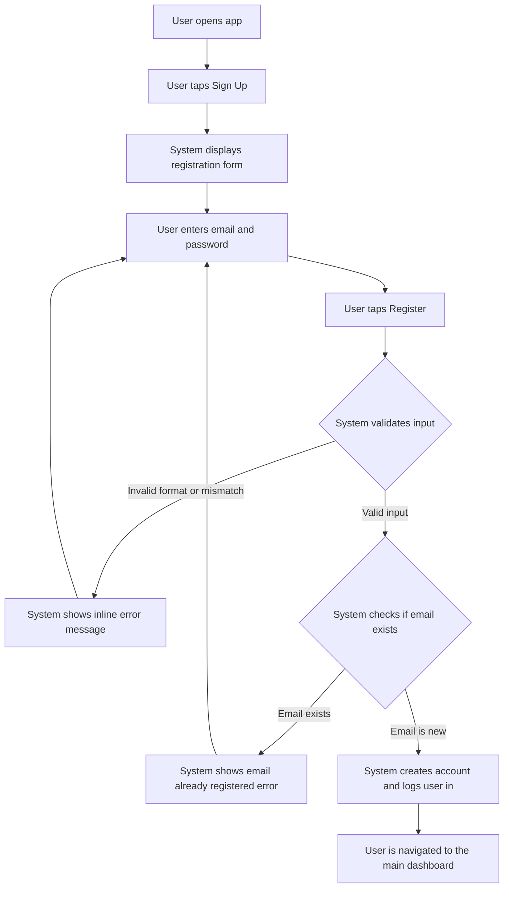

#### [EPIC-001-S2] User Login
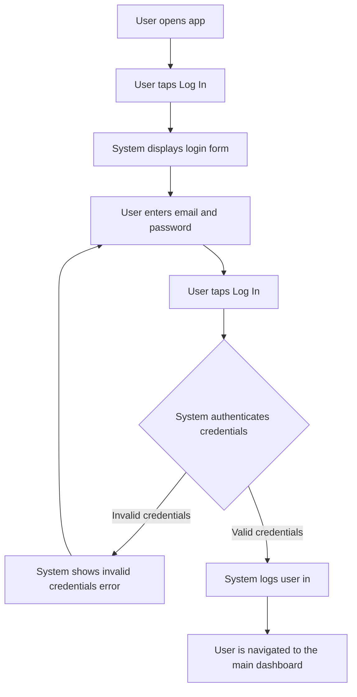

#### [EPIC-001-S3] Basic Profile Management
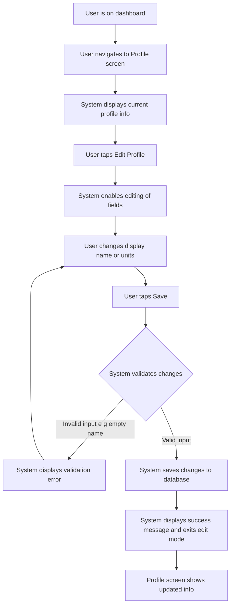

#### [EPIC-002-S1] Initiate New Workout Session
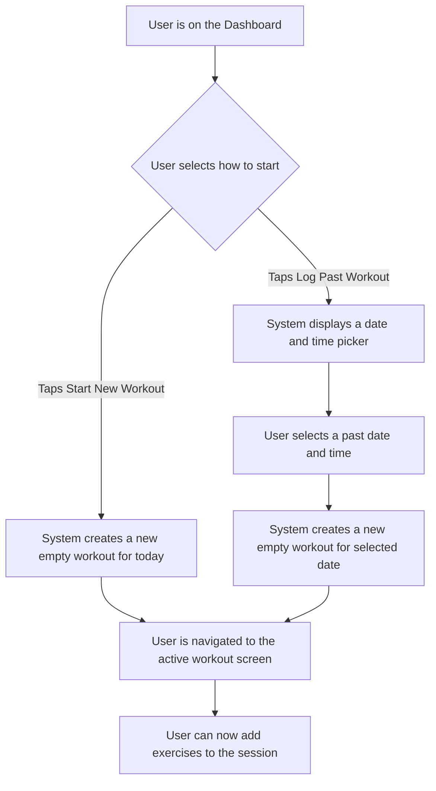

#### [EPIC-002-S2] Select Exercise from Library
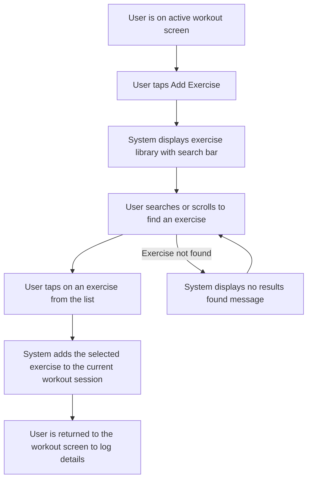

#### [EPIC-002-S3] Add Custom Exercise During Workout
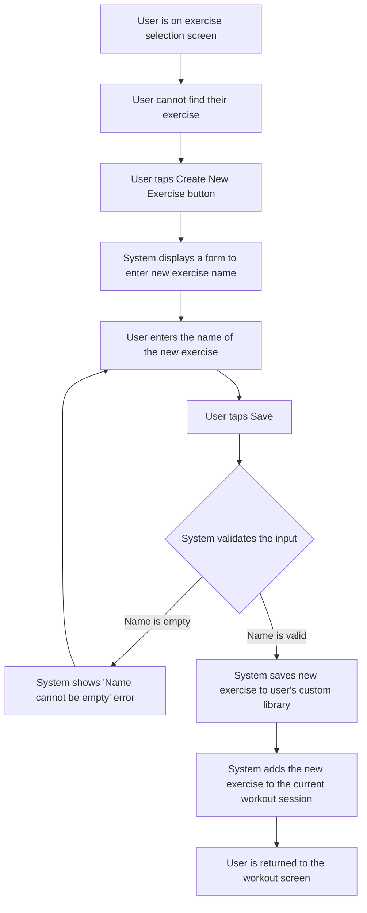

#### [EPIC-002-S4] Record Strength Training Parameters
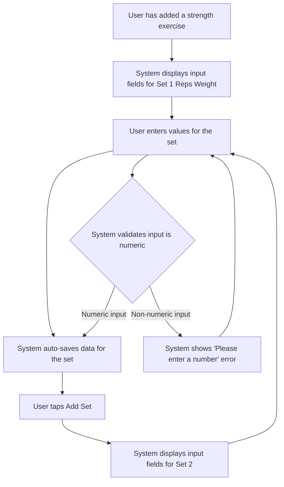

#### [EPIC-002-S5] Record Cardio/Time-Based Parameters
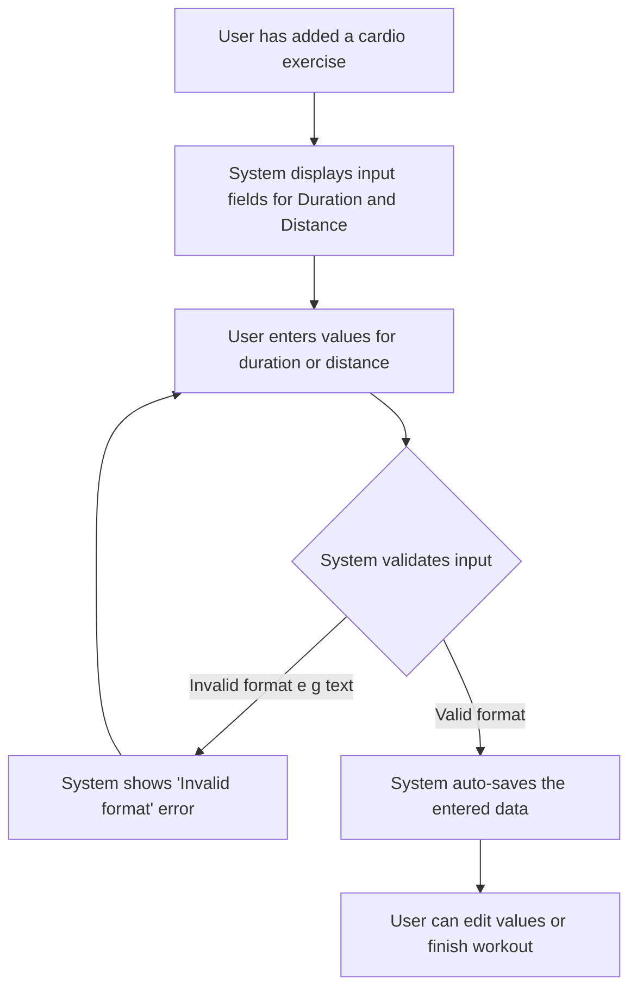

#### [EPIC-002-S6] Record Optional Rest Time
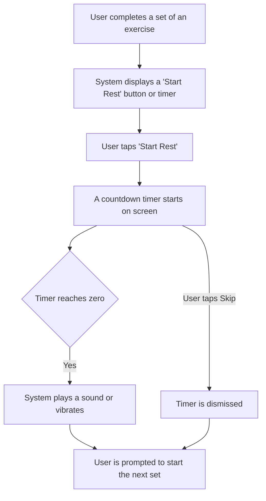

#### [EPIC-002-S7] Complete and Save Workout Session
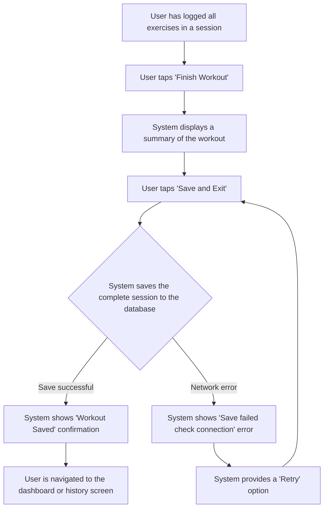

#### [EPIC-002-S8] Edit Past Workout Session
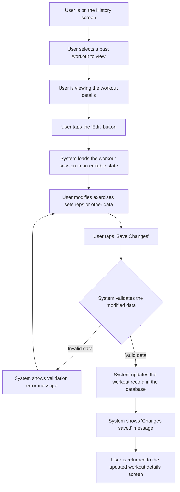

#### [EPIC-002-S9] Delete Past Workout Session
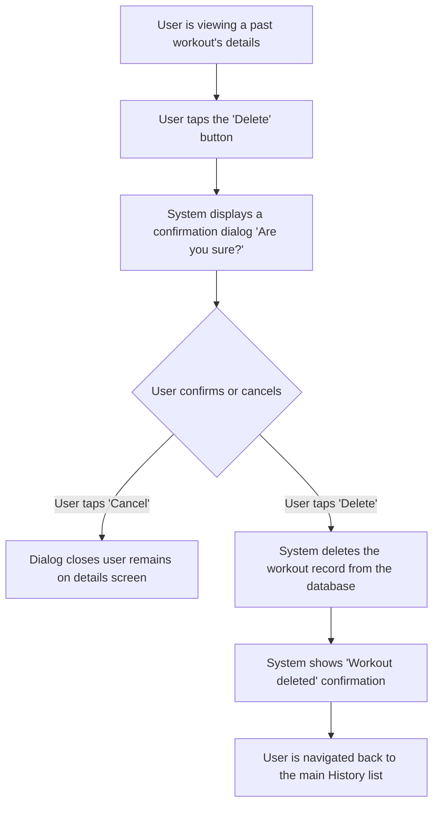

## 2. Screens & Components
| UX-ID | Story ID | User Flow Snippet | Page/Component | Interaction Description | Abnormal Scenarios | Style/Constraints |
| --- | --- | --- | --- | --- | --- | --- |
| UX-001 | EPIC-001-S1 | Enter email/password → Click Register → Redirect to homepage | **Registration Screen**: Email input, Password input, Confirm Password input, Register button, Error message area | On click Register, client-side validation runs. On success, API call is made. On failure, inline error messages are shown. | Email already exists, Passwords do not match, Invalid email format, Weak password, Network error. | Inputs have clear labels. Error messages appear below the relevant field in red. Register button is disabled until all fields are filled. |
| UX-002 | EPIC-001-S2 | Enter email/password → Click Login → Redirect to homepage | **Login Screen**: Email input, Password input, Login button, Error message area, Forgot Password link | On click Login, credentials are sent to the server for verification. | Incorrect email/password combination, Account locked, Network error. | Error message is displayed in a shared area above the button. Inputs are cleared on failed attempt. |
| UX-003 | EPIC-001-S3 | Navigate to Profile → Edit details → Save | **Profile Screen**: Display name, Email (read-only), Unit preference (kg/lbs), Edit button, Save button | Tapping "Edit" enables input fields/selectors. Tapping "Save" persists changes and returns to read-only view. | Empty display name, Invalid selection, Save fails due to network error. | Unit preference is a segmented control or radio button. A success toast appears on save. |
| UX-004 | EPIC-002-S1 | Click "Start New Workout" → Enter workout logging screen | **Dashboard**: "Start New Workout" CTA button, "Log Past Workout" link | "Start New Workout" directly opens the logging screen for the current time. "Log Past Workout" opens a date/time modal first. | User cancels date selection. | "Start New Workout" should be the primary, most prominent action on the screen. |
| UX-005 | EPIC-002-S2 | Tap "Add Exercise" → Search/Select from list → Added | **Exercise Library Modal**: Search bar, List of exercises (categorized/alphabetical), "Create New" button | As user types in search, the list filters in real-time. Tapping an exercise closes the modal and adds it to the workout. | No search results found. | The list should be scrollable. Recently used exercises could be shown at the top for quick access. |
| UX-006 | EPIC-002-S3 | Tap "Create New" → Enter name → Save | **Create Exercise Modal**: Exercise Name input field, Save button, Cancel button | User types a name and saves. The new exercise is saved to their private library and immediately added to the current workout. | Exercise name is blank, Exercise name already exists. | Input field should have a clear label. Error messages are displayed below the input. |
| UX-007 | EPIC-002-S4 | For an exercise → Enter reps/weight for a set → Add another set | **Active Workout Screen**: Exercise Card with columns for Set, Reps, Weight; "Add Set" button | User fills in text inputs for reps and weight. Data is saved per set. "Add Set" creates a new row for input. | Non-numeric input, unrealistically high values (soft validation). | Inputs should be numeric keyboards on mobile. Previously logged data for this exercise could be pre-filled or shown as a hint. |
| UX-008 | EPIC-002-S5 | For an exercise → Enter duration/distance | **Active Workout Screen**: Exercise Card with inputs for Duration (time) and Distance (number) | User fills in time/distance inputs. | Invalid time format, non-numeric distance. | Duration input could use a time picker for easier entry. Distance unit (km/mi) should be based on user profile settings. |
| UX-009 | EPIC-002-S6 | Complete a set → Tap "Start Rest" → Timer appears | **Active Workout Screen**: Rest Timer component (overlay or inline) | After logging a set, a "Start Rest" button appears. Tapping it starts a visual countdown timer. | User accidentally dismisses timer. | Timer should provide a clear visual indicator (e.g., circular progress bar) and an audible/vibration alert upon completion. |
| UX-010 | EPIC-002-S7 | Tap "Finish Workout" → Confirm → Redirect to home | **Active Workout Screen**: "Finish Workout" button. **Workout Summary Screen**: List of exercises performed, "Save" button. | Tapping "Finish" navigates to a summary for final review before saving permanently. | Network error during save, user navigates back without saving (prompt to discard). | The summary screen provides positive reinforcement by showing total volume, time, etc. |
| UX-011 | EPIC-002-S8 | Go to History → Select a workout → Tap Edit → Make changes → Save | **Workout Details Screen**: "Edit" icon/button. **Workout Editor Screen**: Same as active workout UI but pre-filled with data. | User can modify any parameter of the past workout. Save action overwrites the original record. | Invalid data entered during edit, network error on save. | Changes should be clearly highlighted. A confirmation dialog should appear before saving. |
| UX-012 | EPIC-002-S9 | Go to History → Select a workout → Tap Delete → Confirm | **Workout Details Screen**: "Delete" icon/button. **Confirmation Modal**: "Delete Workout?" message, Delete button, Cancel button. | The delete action is protected by a confirmation dialog to prevent accidental data loss. | User cancels the deletion. | The "Delete" button in the confirmation modal should be styled destructively (e.g., red) to signal a permanent action. |

## 3. Interaction Spec
#### [EPIC-001-S1] User Registration
-   **User Action:** Fills registration form and taps "Register".
-   **System Response:** Validates input fields client-side. If valid, sends data to the server. Server validates and checks for existing email.
-   **Success Feedback:** Creates user account, logs user in, navigates to the app's main dashboard. A welcome message is displayed briefly.
-   **Exception Feedback:** Displays specific inline error messages for: invalid email format, password mismatch, or if email is already registered. Shows a general error toast for network failures.

#### [EPIC-001-S2] User Login
-   **User Action:** Fills login form and taps "Log In".
-   **System Response:** Sends credentials to the server for authentication.
-   **Success Feedback:** Logs the user in, navigates to the main dashboard.
-   **Exception Feedback:** Displays an error message "Invalid email or password" on the login screen.

#### [EPIC-001-S3] Basic Profile Management
-   **User Action:** Navigates to profile, taps "Edit", changes data, and taps "Save".
-   **System Response:** Validates the new data (e.g., name is not empty). If valid, sends an update request to the server.
-   **Success Feedback:** The screen exits edit mode, displays the updated information, and shows a temporary success message (e.g., "Profile updated").
-   **Exception Feedback:** Displays an inline error if the input is invalid. Shows a general error toast if the save operation fails.

#### [EPIC-002-S1] Initiate New Workout Session
-   **User Action:** Taps "Start New Workout" or "Log Past Workout" on the dashboard.
-   **System Response:** Creates a new, unsaved workout object. If "Log Past" was chosen, it first prompts for and sets the date.
-   **Success Feedback:** Navigates the user to the active workout logging screen, ready to add exercises.
-   **Exception Feedback:** [Assumption] If an unsaved workout already exists, prompt the user to resume or discard it before starting a new one.

#### [EPIC-002-S2] Select Exercise from Library
-   **User Action:** On the workout screen, taps "Add Exercise", then selects an exercise from the list.
-   **System Response:** Closes the exercise library view and appends the selected exercise to the current workout session list.
-   **Success Feedback:** The user is returned to the workout screen where the new exercise card is visible, ready for data input.
-   **Exception Feedback:** If the list fails to load, a "Could not load exercises" message is shown with a retry button.

#### [EPIC-002-S3] Add Custom Exercise During Workout
-   **User Action:** From the exercise library, taps "Create New", enters a name, and taps "Save".
-   **System Response:** Validates the name, saves the new exercise to the user's custom list, and adds it to the current workout.
-   **Success Feedback:** The create modal closes, and the user is returned to the workout screen with the new custom exercise added.
-   **Exception Feedback:** Displays an inline error if the name is empty or already exists.

#### [EPIC-002-S4] Record Strength Training Parameters
-   **User Action:** Enters numbers into the Reps and Weight input fields for a specific set.
-   **System Response:** The data is temporarily stored in the current session's state. [Assumption] The system may pre-fill the fields with data from the previous set or a past workout for convenience.
-   **Success Feedback:** The input fields reflect the entered numbers. The user can proceed to the next set.
-   **Exception Feedback:** If non-numeric data is entered, the input field shows an error state or rejects the input.

#### [EPIC-002-S5] Record Cardio/Time-Based Parameters
-   **User Action:** Enters values into the Duration and/or Distance input fields.
-   **System Response:** The data is temporarily stored in the current session's state.
-   **Success Feedback:** The input fields reflect the entered values.
-   **Exception Feedback:** If an invalid format is entered (e.g., text in a distance field), the input shows an error state.

#### [EPIC-002-S6] Record Optional Rest Time
-   **User Action:** Taps the "Start Rest" button after completing a set.
-   **System Response:** An on-screen timer begins a countdown from a pre-set or user-defined duration.
-   **Success Feedback:** The timer visually counts down. Upon completion, a sound or vibration alert is triggered.
-   **Exception Feedback:** The user can manually skip or edit the timer if needed.

#### [EPIC-002-S7] Complete and Save Workout Session
-   **User Action:** Taps "Finish Workout", reviews the summary, and taps "Save".
-   **System Response:** The system sends the complete workout session data to the server to be persisted in the database.
-   **Success Feedback:** Displays a "Workout Saved!" confirmation message and navigates the user away from the workout screen (e.g., to the dashboard or history).
-   **Exception Feedback:** If saving fails due to a network error, an error message is displayed with a "Retry" button.

#### [EPIC-002-S8] Edit Past Workout Session
-   **User Action:** Taps "Edit" on a past workout, modifies the data, and taps "Save Changes".
-   **System Response:** Validates the new data and sends an update request to the server.
-   **Success Feedback:** Displays a "Changes Saved" message and returns the user to the read-only view of the updated workout.
-   **Exception Feedback:** Shows validation errors for invalid data. Shows a general error toast if the save operation fails.

#### [EPIC-002-S9] Delete Past Workout Session
-   **User Action:** Taps "Delete" on a past workout and confirms the action in a dialog.
-   **System Response:** Sends a delete request to the server for the specified workout record.
-   **Success Feedback:** The record is deleted. The app shows a "Workout Deleted" confirmation and navigates the user back to the workout history list, which is now updated.
-   **Exception Feedback:** If the user taps "Cancel" in the dialog, the dialog is dismissed and no action is taken.

## 4. Information Architecture
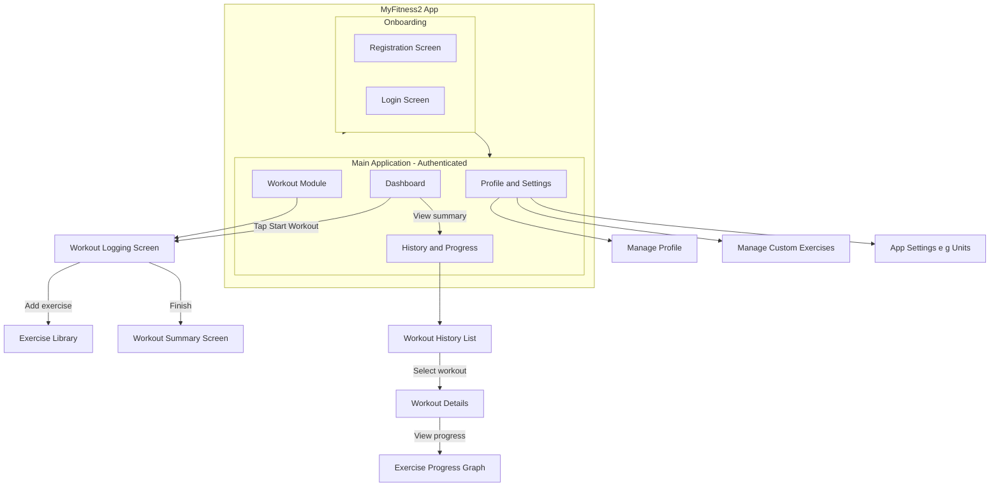

## 5. Covering Index
-   **[EPIC-001] User & Account Management**
    -   [EPIC-001-S1] User Registration: ✅ Output [Contains assumptions]
    -   [EPIC-001-S2] User Login: ✅ Output
    -   [EPIC-001-S3] Basic Profile Management: ✅ Output [Contains assumptions]
-   **[EPIC-002] Workout Session Management**
    -   [EPIC-002-S1] Initiate New Workout Session: ✅ Output [Contains assumptions]
    -   [EPIC-002-S2] Select Exercise from Library: ✅ Output
    -   [EPIC-002-S3] Add Custom Exercise During Workout: ✅ Output
    -   [EPIC-002-S4] Record Strength Training Parameters: ✅ Output [Contains assumptions]
    -   [EPIC-002-S5] Record Cardio/Time-Based Parameters: ✅ Output
    -   [EPIC-002-S6] Record Optional Rest Time: ✅ Output
    -   [EPIC-002-S7] Complete and Save Workout Session: ✅ Output
    -   [EPIC-002-S8] Edit Past Workout Session: ✅ Output
    -   [EPIC-002-S9] Delete Past Workout Session: ✅ Output